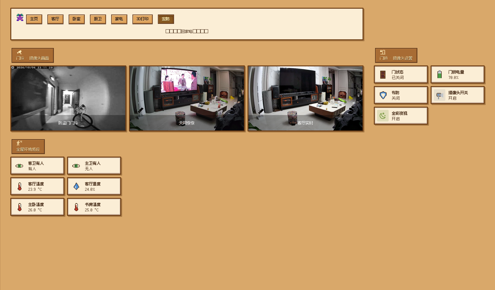
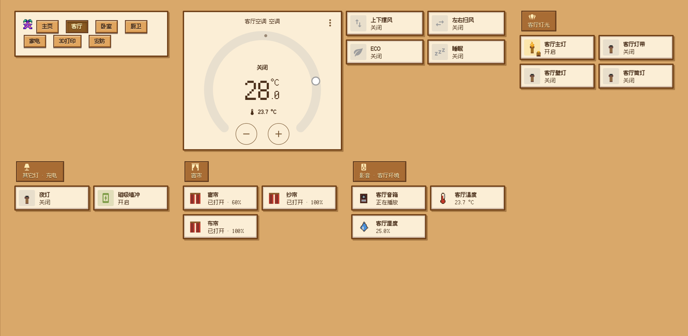
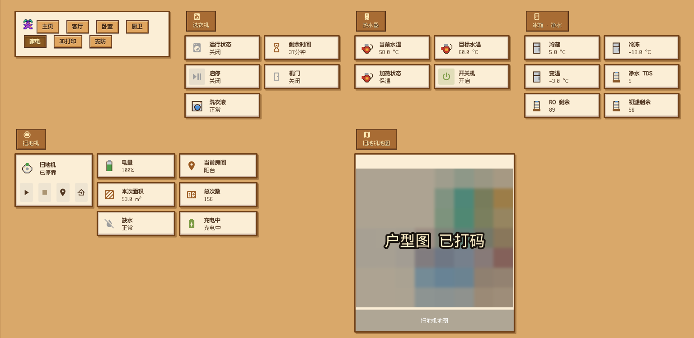

# 🎮 星露谷风 Home Assistant 面板 + 小米摄像头实时流

把家里的 **Home Assistant** 面板做成《星露谷物语》的游戏界面，并把**米家云摄像头**接成真正的实时画面。

> 全部在 NAS 上无头完成：NAS 跑一个 HAOS 虚拟机，脚本通过 HA 的 WebSocket/REST API + Chrome DevTools Protocol 改配置、改皮肤、截图自检 —— 全程不用打开浏览器点来点去。



---

## 隐私说明

预览截图里的**摄像头实时画面**与**扫地机户型图**已做打码处理（马赛克 + 已打码水印），仓库内所有账号、密码、token、内网地址、设备序列号均为 `${...}` 占位符，需自行填入自己的环境。

## ✨ 效果亮点

| 功能 | 说明 |
| --- | --- |
| 🪵 **游戏风皮肤** | 5 套季节皮肤（春/夏/秋/冬 + 夜），木牌标题、木箱卡片、羊皮纸横幅、像素字体 |
| 🖼️ **自绘像素图标** | 25 个 16×16 像素图标（火把/台灯/水滴/温度计/洗衣机/扫地机/木门…），按设备名自动匹配 |
| 🕹️ **木质导航 + 全屏** | 用 kiosk-mode 隐藏侧边栏/顶栏，自绘一排木质按钮当导航，平板即游戏机面板 |
| 📅 **按季节自动换肤** | 一个按月份判断的自动化，3-5 春 / 6-8 夏 / 9-11 秋 / 12-2 冬 |
| ⛽ **今日油价 HUD** | REST 传感器每小时拉一次油价，面板顶部「谷里今日」显示时间/季节/天气/油价/运势 |
| 📹 **摄像头真·实时** | 米家云摄像头经 go2rtc 的 `miss`（P2P）协议本地取流 → 转 H264 → HA 里既能看实时画面也能取实时静帧 |




---

## 🧠 技术要点（踩过的坑都在这里）

1. **HA 卡片内容都在 shadow DOM 里** —— 页面级 CSS 够不着，必须递归遍历 DOM 往每个卡片的 `shadowRoot` 注入 `<style>`（`scripts/stardew.js`）。
2. **外层 `!important` 赢过 shadow 内层** —— 想覆盖卡片边框要么注入到元素所在的那个 shadow root，要么用更高特异性的选择器。
3. **HA 的 `markdown` 卡片会把整个 `style` 属性剥掉** —— 要控制图片大小只能把尺寸烤进图片文件，改图后必须 `?v=N` 破缓存。
4. **格子列数按名字长度自动定** —— 4 列时中文名会被截成「客厅…」，3 列刚好、长名字用 2 列。
5. **用户手改过的视图别覆盖** —— 生成脚本 `--apply` 时按 `path` 匹配、只替换要改的视图，其余从线上原样带回，保存后字节级比对确认没动。
6. **截图自检**：NAS 上的 Chrome 常驻 CDP，`scripts/ha_shot.py` 注入 token 截长图，`ha_card.py` 截单卡，`ha_dom.py` 看真实元素，`ha_navtest.py` 验证导航能点。
7. **米家云摄像头拿不到实时流**：miot 对云接入设备只给「事件截图 + 事件片段」。真·实时要用 **go2rtc 的 `xiaomi`（`miss`/P2P）源**，本地直连摄像头（不需要摄像头开放任何端口）。
8. **HA 2026.9 起 `generic` camera 不是 YAML platform 了** —— 必须走 config flow；校验会真连流，转码流要先预热，否则 `errors.stream_source=timeout`。

---

## 🚀 快速上手

```bash
# 0) 依赖：python3 + requests/websockets/cryptography/Pillow，一个能开 CDP 的 Chrome
# 1) 配置 HA 连接（不要硬编码密码，用环境变量）
export HA_BASE=http://${HA_HOST}      # HA 地址（本示例跑在 80 端口）
export HA_USER=<你的 HA 账号>
export HA_PWD=<你的 HA 密码>
python3 scripts/ha_api.py rest GET /api/config

# 2) 生成主题 + 素材，装到 HA
python3 scripts/make_stardew_theme.py      # 生成 5 套季节皮肤 yaml → /config/themes/
python3 scripts/gen_game_icons.py          # 自绘 25 个像素图标 → /config/www/stardew/img/game/
python3 scripts/gen_ui_assets.py           # 木牌/木按钮/羊皮纸纹理

# 3) 让面板"像游戏"（把 stardew.js 作为 Lovelace 资源注册 + 皮肤设为默认）
#    WS lovelace/resources/create {url:"/local/stardew/stardew.js?v=1", res_type:"module"}
#    WS frontend/set_theme {name:"stardew_fall"}

# 4) 面板截图自检
python3 scripts/ha_shot.py home-control/main /tmp/panel.png 1536 900 desktop
```

**摄像头实时流**（详见 `assets/go2rtc.example.yaml`）：

```bash
# NAS 上跑 go2rtc（docker 或单文件二进制），登录小米账号后：
#   streams: micam1  = 原始流(H265) / micam1_h264 = 转 H264
# HA 里加 generic camera（config flow）：
#   stream_source    = rtsp://${NAS_IP}:8554/micam1_h264
#   still_image_url  = http://${NAS_IP}:1984/api/frame.jpeg?src=micam1
#   advanced         = {framerate:15, verify_ssl:true, rtsp_transport:"tcp"}
```

---

## 📁 目录结构

```
├── SKILL.md                     # 完整操作手册（给 AI/人看的 how-to，含全部坑）
├── scripts/
│   ├── ha_api.py                # HA 无头客户端（登录/token/REST/WS）
│   ├── ha_file.py               # 通过 Samba 读写 HA /config
│   ├── ha_shot.py               # CDP 截图（长图/指定宽度）
│   ├── ha_card.py               # 只截某张卡片（自动滚动预热）
│   ├── ha_dom.py                # dump 真实 shadow DOM 结构
│   ├── ha_imgcheck.py           # 图片声明尺寸 vs 实际渲染尺寸
│   ├── ha_navtest.py            # 点击自绘导航并验证跳转
│   ├── build_dashboard.py       # 数据驱动生成仪表盘（含"别覆盖用户手改视图"保护）
│   ├── make_stardew_theme.py    # 生成 5 套季节主题 yaml
│   ├── gen_game_icons.py        # 自绘像素图标 + 木箱/木牌素材
│   ├── gen_ui_assets.py         # 木按钮/木标牌/羊皮纸纹理
│   └── stardew.js               # 注入 shadow DOM 的游戏化 CSS（木质控件/图标映射）
└── assets/
    ├── themes/                  # 5 套季节主题（可直接放进 /config/themes/）
    ├── icons/                   # 自绘像素图标（本仓库原创，可自由使用）
    └── go2rtc.example.yaml      # 小米摄像头实时流配置模板
```

---

## ⚖️ 免责声明 / Disclaimer

### 中文

- 本项目是**个人自用的非官方粉丝作品**，与《星露谷物语》(Stardew Valley) 的开发者 **ConcernedApe** 及其发行方**没有任何关联**，也未获得其授权、赞助或认可。
- *Stardew Valley*、《星露谷物语》及相关名称、角色、音乐、美术素材的**著作权与商标权均归 ConcernedApe 所有**。
- **本仓库不包含任何从游戏中提取的原始素材文件**：`assets/icons/` 的像素图标与木牌/木箱/羊皮纸等界面素材，全部由 `scripts/gen_game_icons.py`、`scripts/gen_ui_assets.py` **程序化自绘生成**，只是在风格上致敬原游戏的像素/木质 UI；截图里的"游戏感"界面同样是这些自绘素材 + CSS 拼出来的。
- 本项目**仅供个人学习与技术交流，请勿用于商业用途**。如需商用，请自行替换全部美术素材、字体与命名，并自行承担相应法律责任。
- 本项目也**不是 Home Assistant 或米家(小米) 的官方项目**，相关名称与商标归各自所有者。
- 面板使用的像素字体为 **方舟像素字体 (Fusion Pixel)**，按 **SIL Open Font License 1.1 (OFL)** 使用（本仓库未随附字体文件）。
- 仓库未附加开源许可证文件，默认**保留所有权利**；`scripts/` 与自绘素材可自由参考/取用（建议注明出处），整仓库转载请先联系作者。
- 预览截图中的**摄像头实时画面**与**扫地机户型图**已打码；仓库内所有账号、密码、token、内网地址、设备序列号均为 `${...}` 占位符（`${HA_PWD}`、`${NAS_IP}` 等），请自行填入自己的环境。

### English

This is an **unofficial, personal fan project**. It is **not affiliated with, authorized, sponsored or endorsed by ConcernedApe** (creator of *Stardew Valley*) or its publishers. *Stardew Valley* and all related names, characters, music and artwork are the property of ConcernedApe.

**No original game assets are distributed in this repository.** Every sprite under `assets/icons/` and all wood/parchment UI assets are **generated programmatically by the scripts included here** (`gen_game_icons.py`, `gen_ui_assets.py`) — they only pay tribute to the game's pixel-art style. The screenshots likewise contain nothing but these self-drawn assets plus CSS.

This project is for **personal, non-commercial and educational use only**. For commercial use, replace every piece of artwork, font and naming yourself and bear the legal consequences. It is **not** an official project of Home Assistant or Mi Home / Xiaomi either.

The pixel font used by the dashboard is **Fusion Pixel (方舟像素字体)**, licensed under the **SIL Open Font License 1.1** (not bundled here).

No open-source license file is attached: all rights reserved by default. You are free to reference/adapt the scripts and self-drawn assets with attribution; please contact the author before reposting the whole repository.

Camera feeds and the robot-vacuum floor plan in the preview screenshots are masked. Every credential, token and inner-network address in this repo is a `${...}` placeholder.
